# HW 3


## Сетап
Треба мати докер, аби розгорнути додаток:  

```
docker compose up -d --build
```

Можна побачити, що все успішно розгорнулося:
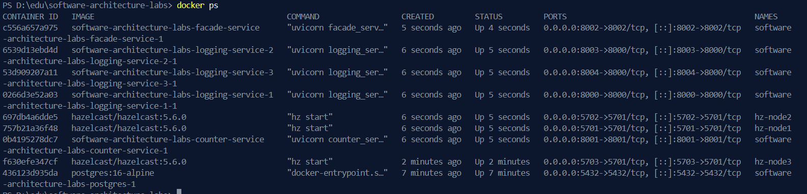  


## Перевірка load balancing через запити
Я перевизначив `test.http` файл, у якому логую 10 тразнакцій.  

Після виконання кожного з запитів, я зібрав логи з кожного сервісу, їх можна знайти в `./assets`.
```
docker compose logs logging-service-1 --tail=200 > assets/logging-service-1.log
docker compose logs logging-service-2 --tail=200 > assets/logging-service-2.log
docker compose logs logging-service-3 --tail=200 > assets/logging-service-3.log
docker compose logs facade-service --tail=200 > assets/facade-service.log
docker compose logs counter-service --tail=200 > assets/counter-service.log
```

Можна побачити, що всі запити пройшли успішно. Також, можна побачити, як розподілялися дані між нодами:  

**node 1**
```
logging-service-1-1  | [logging-service-1] gRPC LogTransaction called with request: {'transaction_id': '813e4bc6-66b1-4aa3-81d3-096f597882d4', 'user_id': 'msg1', 'amount': 1.0, 'timestamp': '2026-03-22T14:56:09.203297'}
logging-service-1-1  | [logging-service-1] Logged transaction via gRPC: 813e4bc6-66b1-4aa3-81d3-096f597882d4 (user_id=msg1, amount=1.0)
logging-service-1-1  | [logging-service-1] gRPC LogTransaction called with request: {'transaction_id': 'd722552c-0d31-4987-8881-a99c011cb385', 'user_id': 'msg3', 'amount': 3.0, 'timestamp': '2026-03-22T14:56:11.298798'}
logging-service-1-1  | [logging-service-1] Logged transaction via gRPC: d722552c-0d31-4987-8881-a99c011cb385 (user_id=msg3, amount=3.0)
logging-service-1-1  | [logging-service-1] gRPC LogTransaction called with request: {'transaction_id': '1fd80a78-2e87-4b97-a442-f61851c31e3d', 'user_id': 'msg8', 'amount': 8.0, 'timestamp': '2026-03-22T14:56:16.452927'}
logging-service-1-1  | [logging-service-1] Logged transaction via gRPC: 1fd80a78-2e87-4b97-a442-f61851c31e3d (user_id=msg8, amount=8.0)
```  

**node 2**
```
logging-service-2-1  | [logging-service-2] gRPC LogTransaction called with request: {'transaction_id': 'cee23b4a-a3e0-4df1-ad80-ad26ecc10e44', 'user_id': 'msg2', 'amount': 2.0, 'timestamp': '2026-03-22T14:56:10.419266'}
logging-service-2-1  | [logging-service-2] Logged transaction via gRPC: cee23b4a-a3e0-4df1-ad80-ad26ecc10e44 (user_id=msg2, amount=2.0)
logging-service-2-1  | [logging-service-2] gRPC LogTransaction called with request: {'transaction_id': '3dbbf0e0-5969-477f-ba35-a97798773369', 'user_id': 'msg9', 'amount': 9.0, 'timestamp': '2026-03-22T14:56:17.132080'}
logging-service-2-1  | [logging-service-2] Logged transaction via gRPC: 3dbbf0e0-5969-477f-ba35-a97798773369 (user_id=msg9, amount=9.0)
logging-service-2-1  | [logging-service-2] gRPC LogTransaction called with request: {'transaction_id': '57e5200e-524f-4940-beef-742b66d19eb2', 'user_id': 'msg10', 'amount': 10.0, 'timestamp': '2026-03-22T14:56:18.177917'}
logging-service-2-1  | [logging-service-2] Logged transaction via gRPC: 57e5200e-524f-4940-beef-742b66d19eb2 (user_id=msg10, amount=10.0)
```  

**node 3**
```
logging-service-3-1  | [logging-service-3] gRPC LogTransaction called with request: {'transaction_id': '1036bb76-0cd2-4e95-8b1b-3948a04fc214', 'user_id': 'msg4', 'amount': 4.0, 'timestamp': '2026-03-22T14:56:12.458441'}
logging-service-3-1  | [logging-service-3] Logged transaction via gRPC: 1036bb76-0cd2-4e95-8b1b-3948a04fc214 (user_id=msg4, amount=4.0)
logging-service-3-1  | [logging-service-3] gRPC LogTransaction called with request: {'transaction_id': 'a0454321-9ad2-44d6-a361-9fc71e56aa2e', 'user_id': 'msg5', 'amount': 5.0, 'timestamp': '2026-03-22T14:56:13.207160'}
logging-service-3-1  | [logging-service-3] Logged transaction via gRPC: a0454321-9ad2-44d6-a361-9fc71e56aa2e (user_id=msg5, amount=5.0)
logging-service-3-1  | [logging-service-3] gRPC LogTransaction called with request: {'transaction_id': 'e7ab472a-5006-434e-9fff-da092afc0886', 'user_id': 'msg6', 'amount': 6.0, 'timestamp': '2026-03-22T14:56:14.486542'}
logging-service-3-1  | [logging-service-3] Logged transaction via gRPC: e7ab472a-5006-434e-9fff-da092afc0886 (user_id=msg6, amount=6.0)
logging-service-3-1  | [logging-service-3] gRPC LogTransaction called with request: {'transaction_id': '5714e68b-55d5-4086-9eb8-5e77ba386d27', 'user_id': 'msg7', 'amount': 7.0, 'timestamp': '2026-03-22T14:56:15.314268'}
logging-service-3-1  | [logging-service-3] Logged transaction via gRPC: 5714e68b-55d5-4086-9eb8-5e77ba386d27 (user_id=msg7, amount=7.0)
```

Можемо перевірити баланси з допомогою GET запиту до facade, `GET /accounts/` 
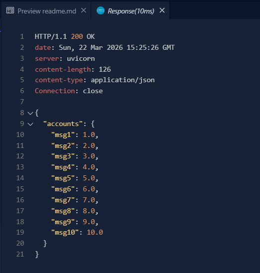


Також можна перевірити транзакції кожного конкретного користувача:
[`./assets/user_trans.log`](./assets/user_trans.log)
## Перевірка відмовостійкості
### Відмовостійкість з docker
Спробуємо відключити одну ноду сервісу логування:
```
docker compose stop logging-service-1
```  
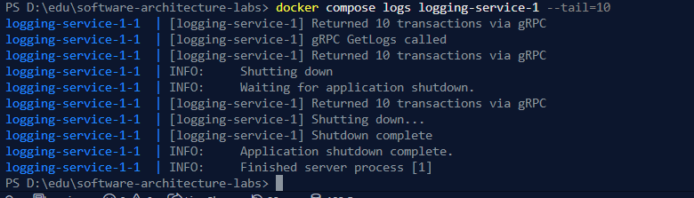  


Використаємо ті самі http запити, що й в попередній частині.  
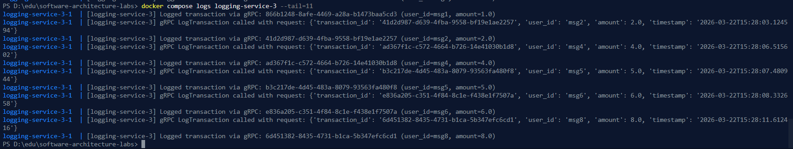
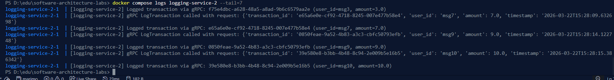   

Перевіримо загальні баланси: 
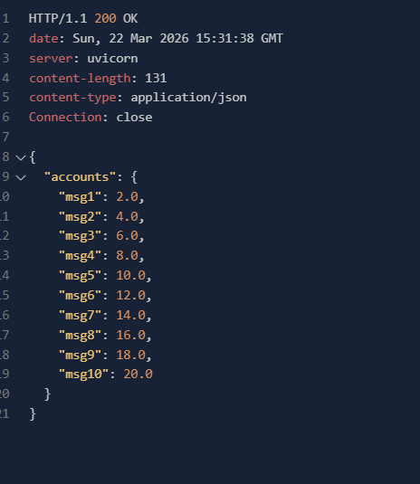  

Як і очікувалося, все добре.   


Тепер, вимкнемо наступну ноду, і повторимо схожі тести.  

```
docker compose stop logging-service-2
```  
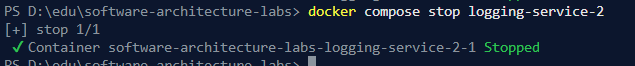  

Використаємо `test.http`:
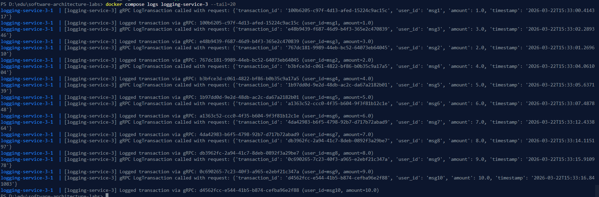

Перевіримо загальні баланси:  
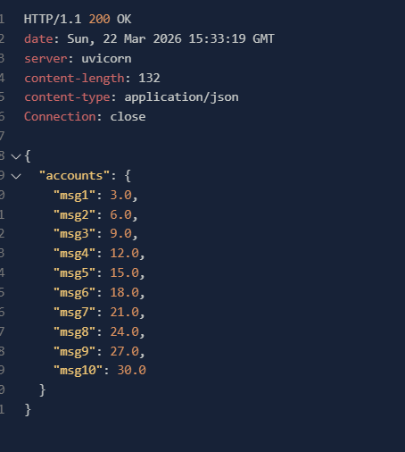  

### Відмовостійкість з hazelcast
Зупинемо hazelcast ноду, та зробимо схожі перевірки:
```
docker compose stop hz-node1
```
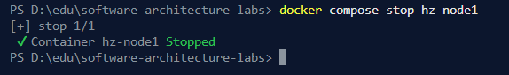  

Після запитів з `test.http`:  
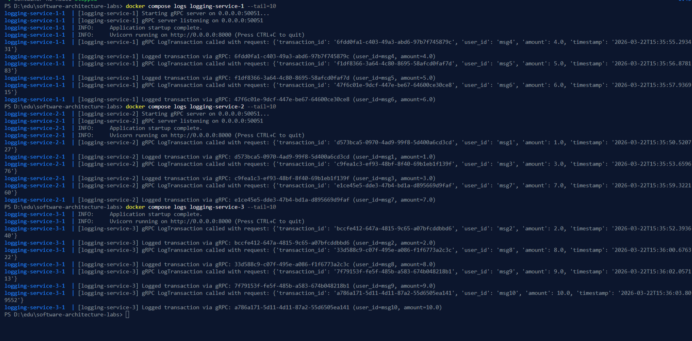

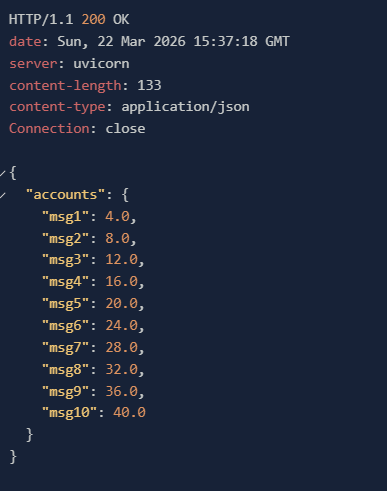  

Аналогічно до тестів з логуванням, зупинемо наступну ноду.  

```
docker compose stop hz-node2
```

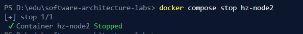  

Після запитів з `test.http`:  

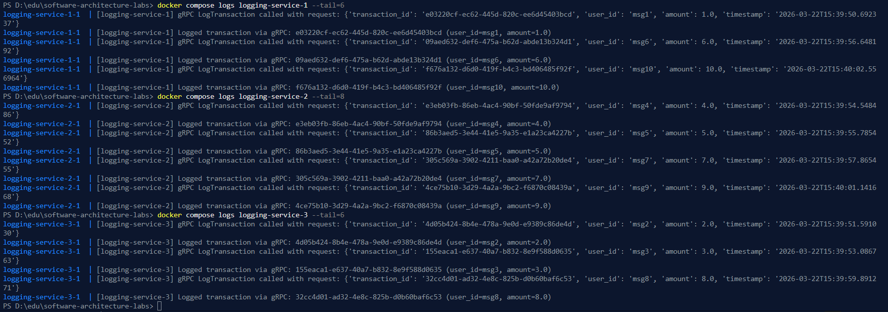  

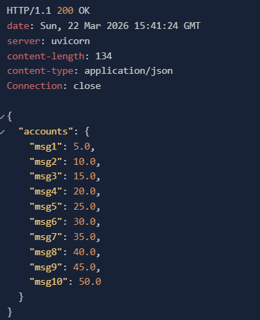  

## Перевірка стресостійкості
Важливо перевірити продуктивність системи. Для цього було створено скрипт [`perf_client.py`](./perf_client.py).  

> [!IMPORTANT]
> Оскільки мій лептоп не має дуже потужного процесора, я попросив [колегу](https://www.github.com/annastasyshyn) з MacBook Pro M1 проранити тести.  

Було розглягуто 2 сценарії:  

> *"10 клієнтів одночасно роблять по 10К однакових транзакцій по додаванню 1 на свій рахунок. У результаті кінцеве значення балансу на 10-и рахунках має бути по 10К."*  
`python perf_client.py --clients 10 --requests-per-client 10000 --amount 1 --verify`  
Було отримано наступні результати:   

*Для непаралельної імлпементації:*
```
Total requests: 100000
Elapsed seconds: 218.5242
Requests per second: 457.62
Logging total seconds: 1212.0889
Counter total seconds: 1182.8852
Accounts: {'user-0': 10000.0, 'user-5': 10000.0, 'user-1': 10000.0, 'user-2': 10000.0, 'user-3': 10000.0, 'user-6': 10000.0, 'user-4': 10000.0, 'user-7': 10000.0, 'user-9': 10000.0, 'user-8': 10000.0}
```   

*Для паралельної:*  

```
Total requests: 100000
Elapsed seconds: 173.6704
Requests per second: 575.8
Logging total seconds: 477.4593
Counter total seconds: 1074.8162
Accounts: {'user-3': 10000.0, 'user-0': 10000.0, 'user-7': 10000.0, 'user-4': 10000.0, 'user-1': 10000.0, 'user-9': 10000.0, 'user-2': 10000.0, 'user-6': 10000.0, 'user-5': 10000.0, 'user-8': 10000.0}
```


> *"10 клієнтів одночасно роблять по 10К однакових транзакцій по додаванню 1 на один і той самий рахунок. У результаті кінцеве значення балансу на одному рахунках має бути 100К."*  
`python perf_client.py --clients 10 --requests-per-client 10000 --amount 1 --same-user --verify`  
Було отримано наступні результати:  


*Для непаралельної імплементації:*  

```Total requests: 100000
Elapsed seconds: 218.5179
Requests per second: 457.63
Logging total seconds: 1208.8978
Counter total seconds: 1186.5043
User balance: 100000.0
```

*Для паралельної імлпементації:*

```
Total requests: 100000
Elapsed seconds: 159.9501
Requests per second: 625.2
Logging total seconds: 433.6909
Counter total seconds: 1006.4237
User balance: 100000.0
```  


Можна побачити, що результати всюди зібглися. У випадку з записом на різних клієнтів, різниця менша, проте вона присутня, приблизно 20% (паралельна швидша на 20%), коли у випадку з записом на того самого юзера -- різниця в 3 рази!