# HW 4
Я обрав варіант з Kafka.  

## Інсталяція 

Аби підняти сервіси, слід використати docker compose.  

```
docker compose up --build -d
```  

## Демонстрація  
### Коректність білду
Спочатку, я збілдив докер, і перевірив, що всі контейнери працюють:  

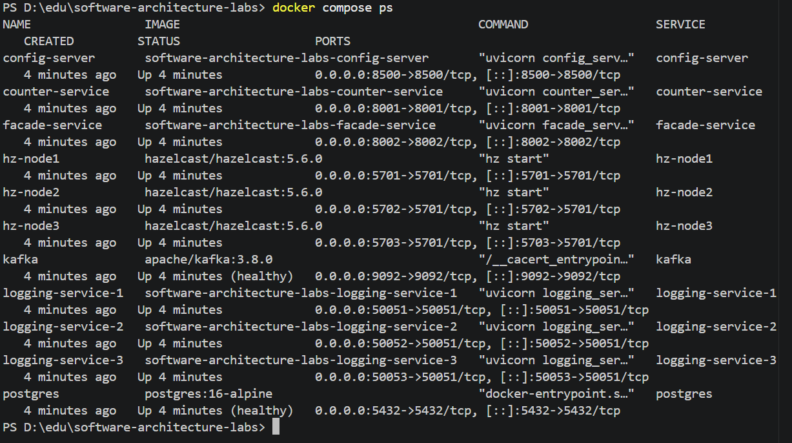  

*через CLI*  


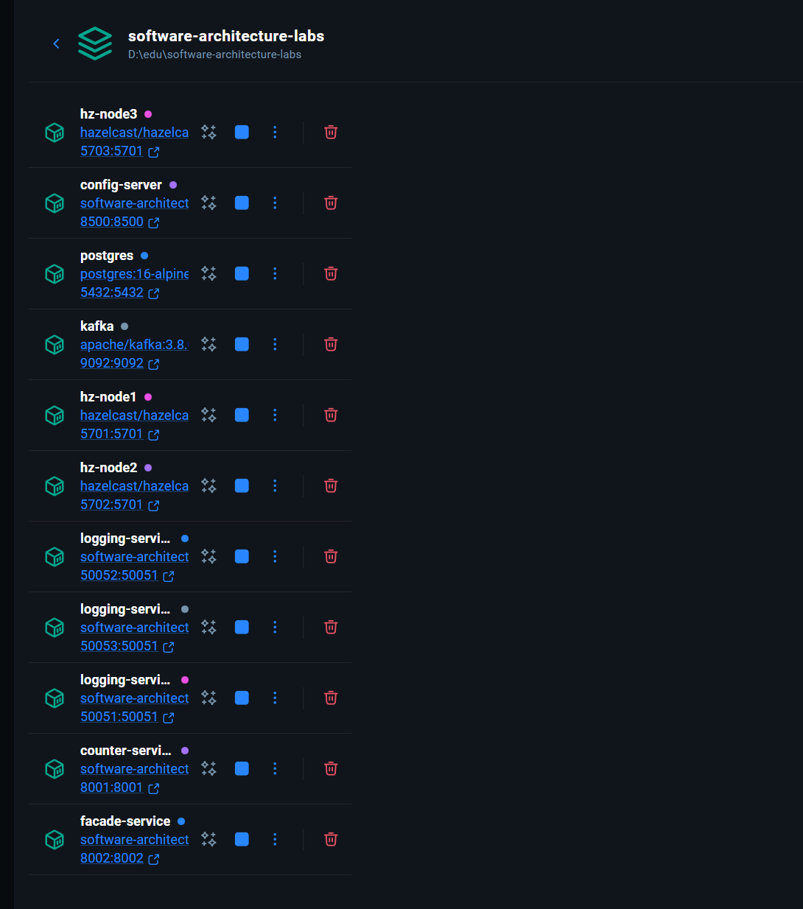  

*та через GUI*  


Опісля, можна подивитися на базові endpoints:  

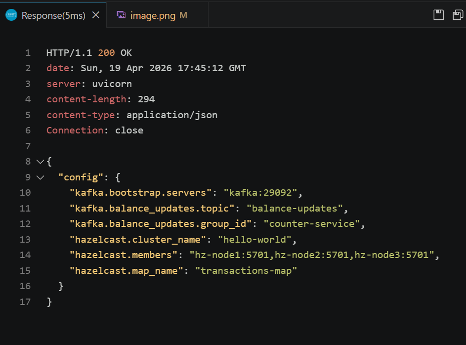   

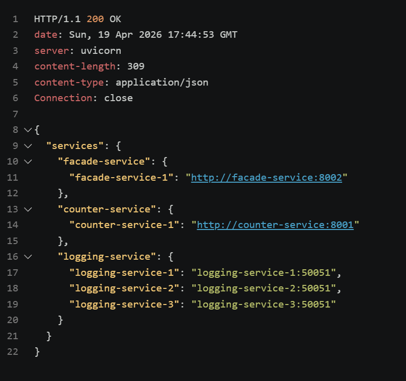  

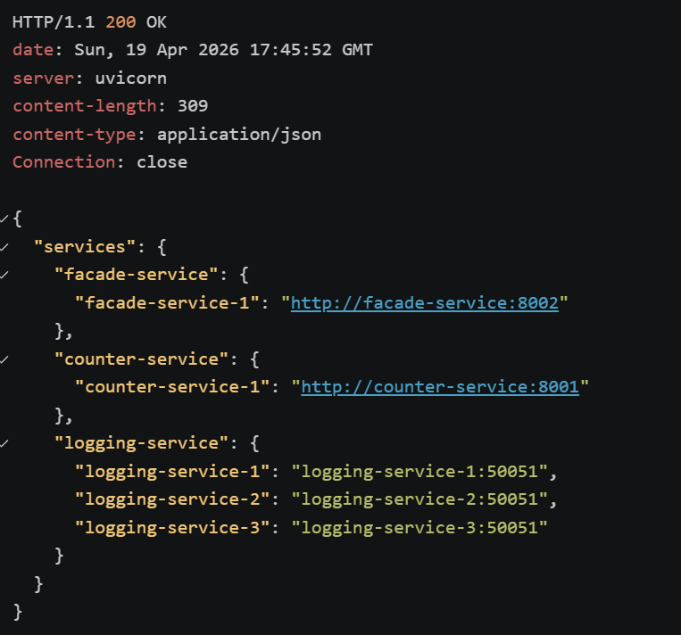  

### Коректність роботи черги  

Далі, я надіслав кілька POST-запитів з `test.http`:   

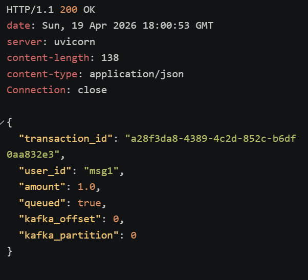  


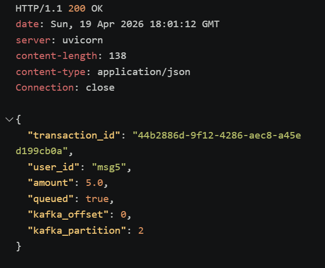  


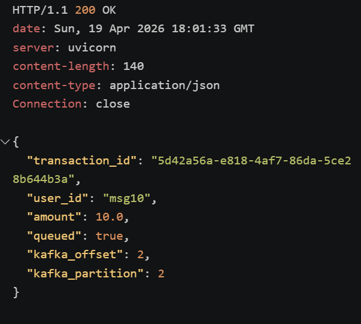  

(приклад успішно надісланих реквесті, можна побачити, що кожен має різні пари offsets та partitions)  

Перевіримо загально акаунти:  

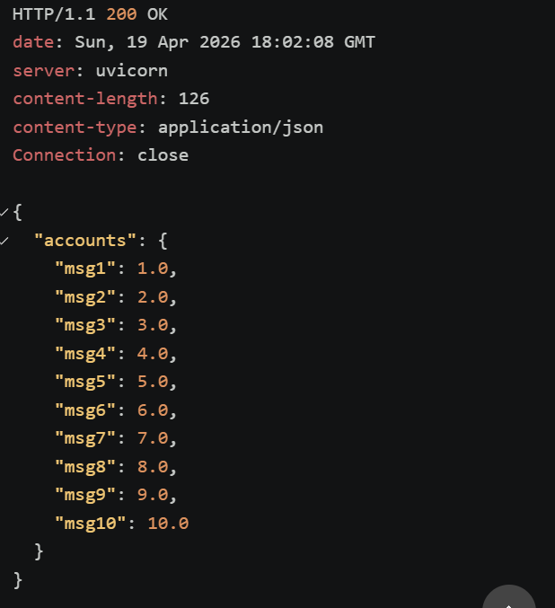  

Також, можна побачити в логах, що різні ноди отримують різні порції даних (є трохи запитів з наступної частини завдання, проте це не заважає демонстрації роботи черги):  
- [`./assets/logging_logs_pause.txt`](assets/logging_logs_pause.txt)  
- [`./assets/counter_logs.txt`](assets/counter_logs.txt)  

### Відмовостійкість  

Тепер слід перевірити відмовостійкість у кейсах, коли падає counter.  

Спочатку, через `docker pause` я зупини counter:  

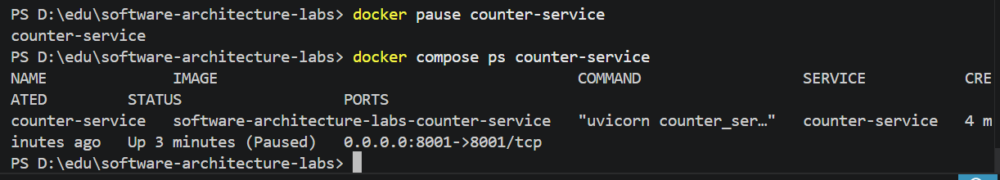  

Опісля, я зробив три нові транзакції:  

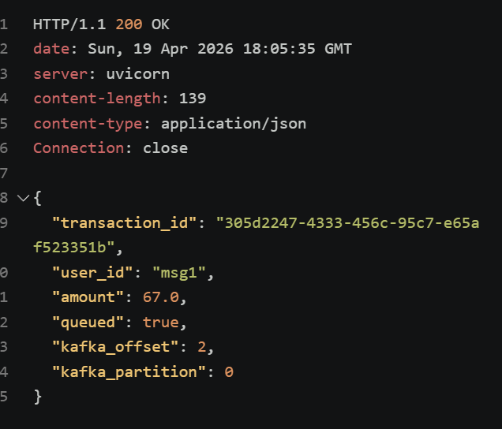  

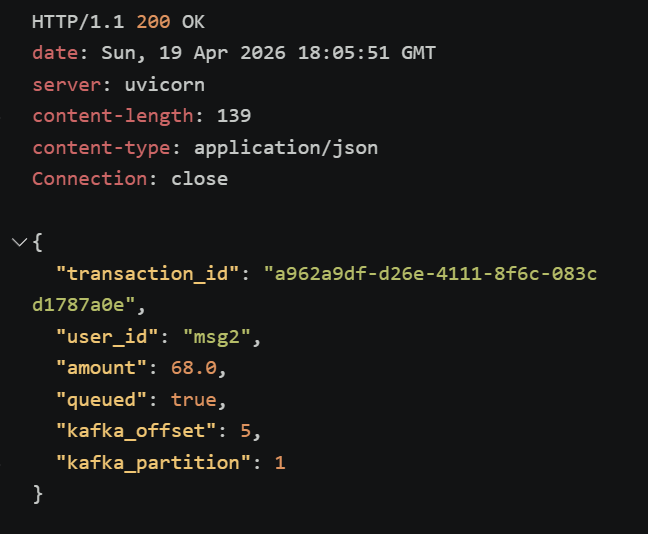  

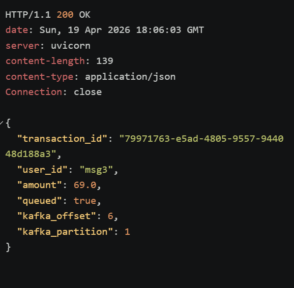  

Можемо перевірити конкретні рахунки:  

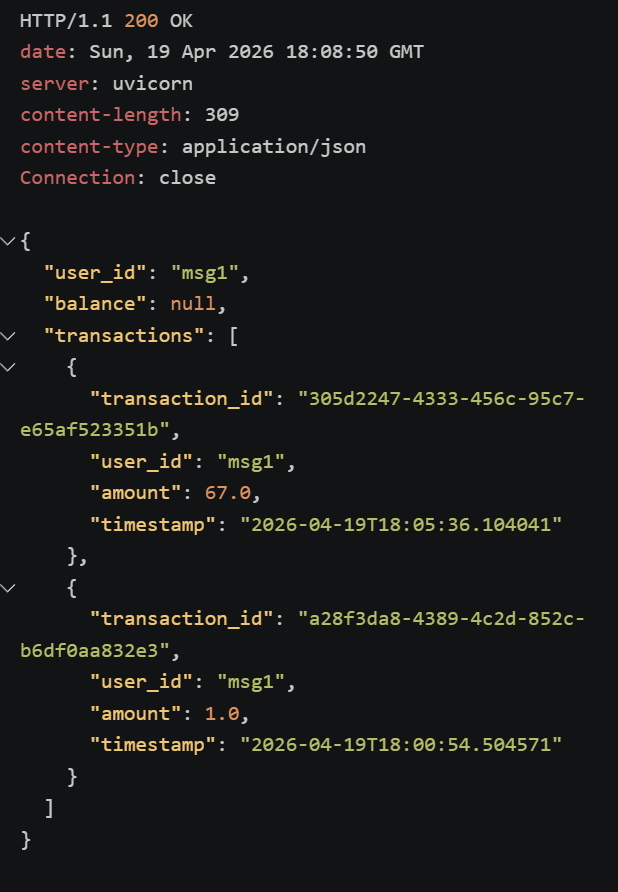  

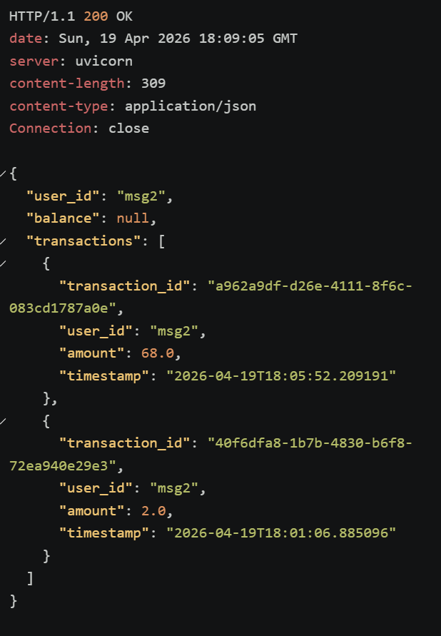  

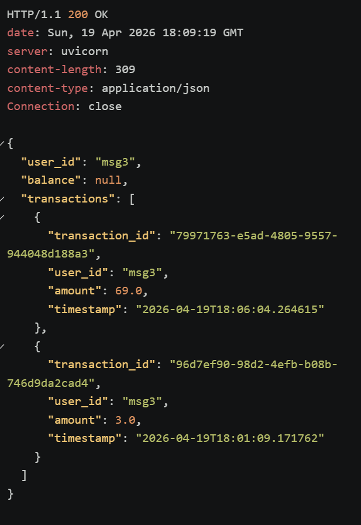  

Перевіримо всі рахунки:  

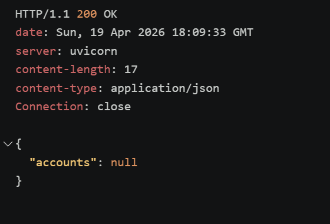  

Можн апобачити, що баланси є null, оскільки counter впав.

Можна перевірити стан Kafka: 

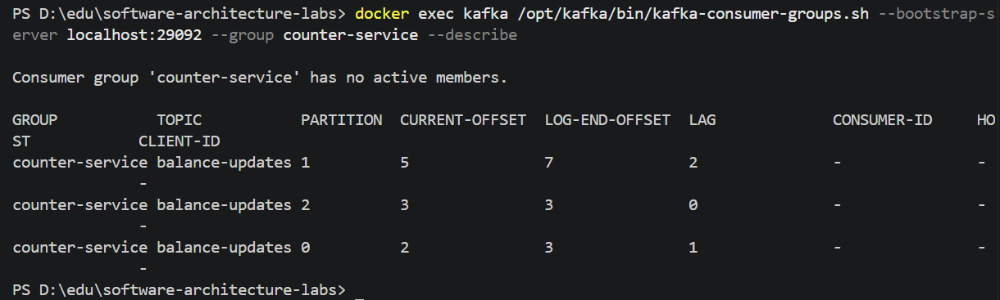  

Як видно з логів, зараз є lags, що свідчить про те, що меседжі ще не дійшли.  

Тепер, розморозимо counter service.  

Логи можна побачити у наступному файлі -- [](assets/unpause_logs.txt).  

Також, перевіримо Kafka:  

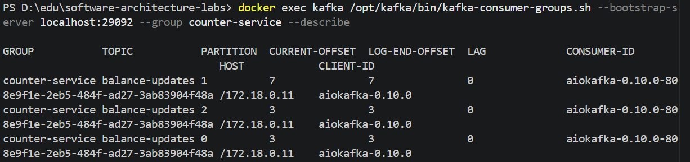  

Як можна побачити, зараз немає lag. 

Перевіримо тепер GET зі всіма балансами: 

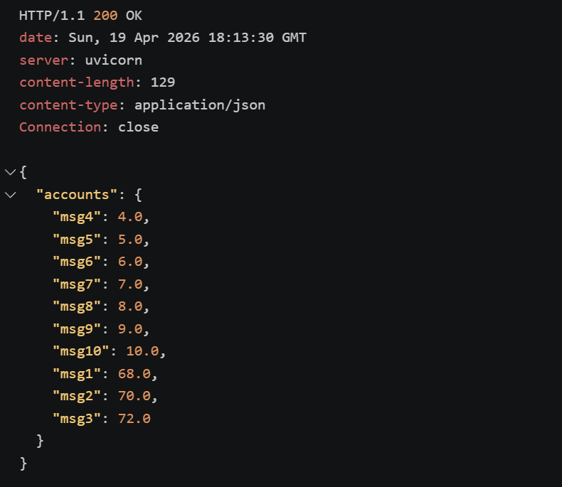  

Можна побачити, що транзакції дійшли, і тепер все добре! 