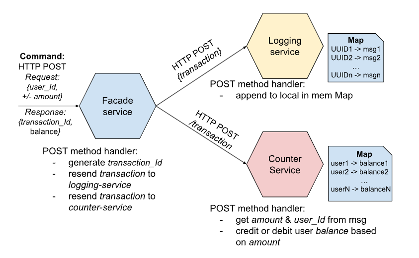
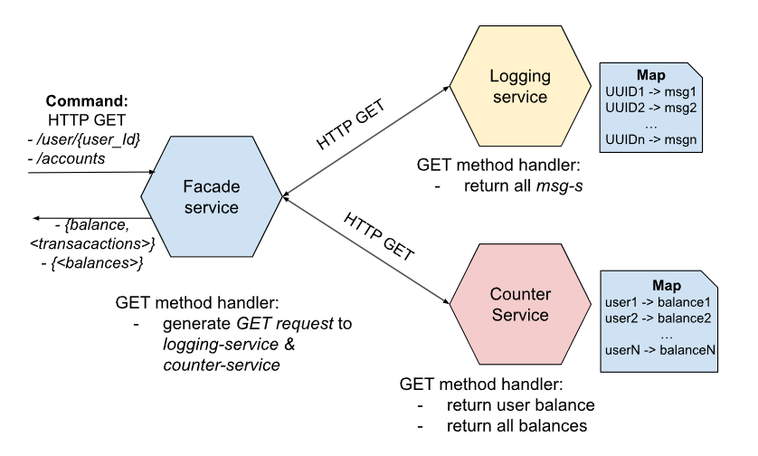
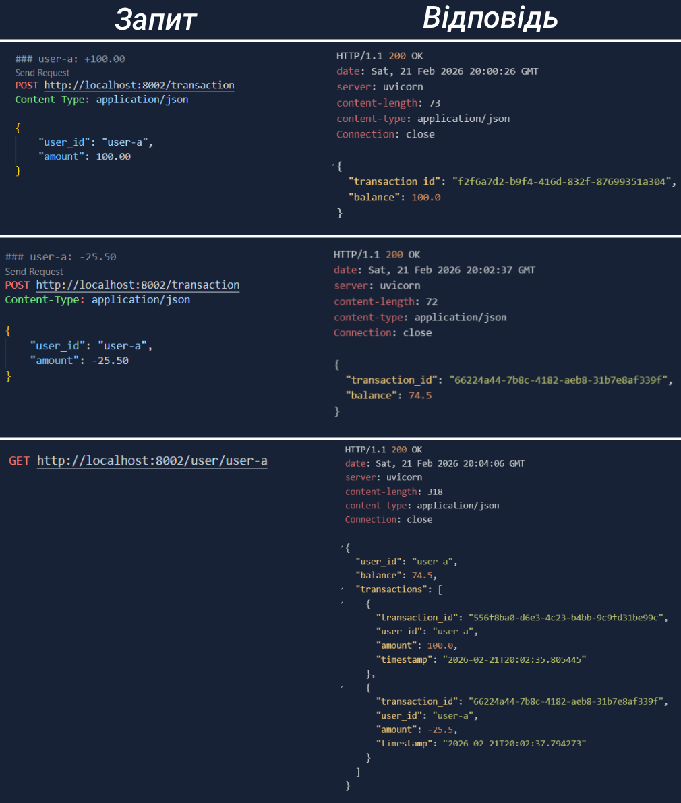
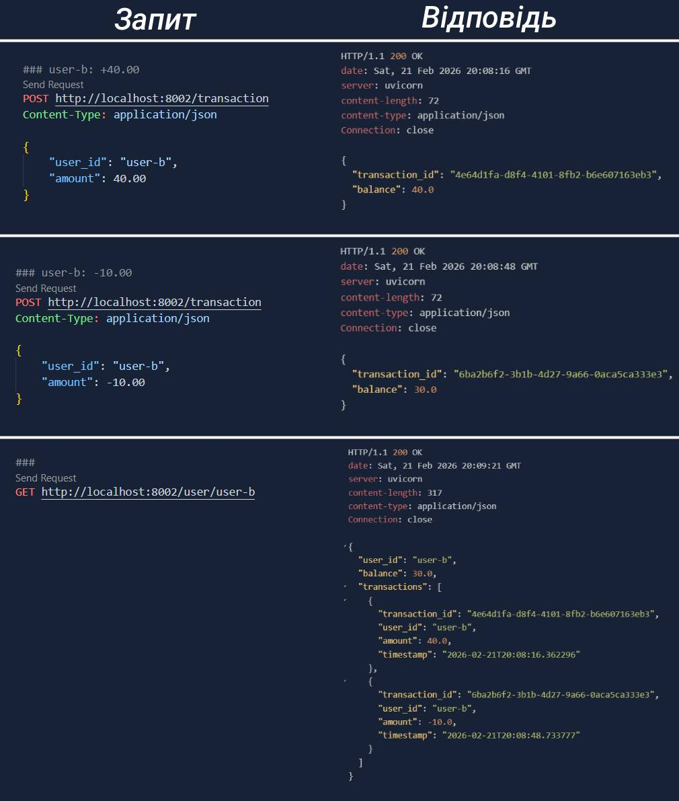
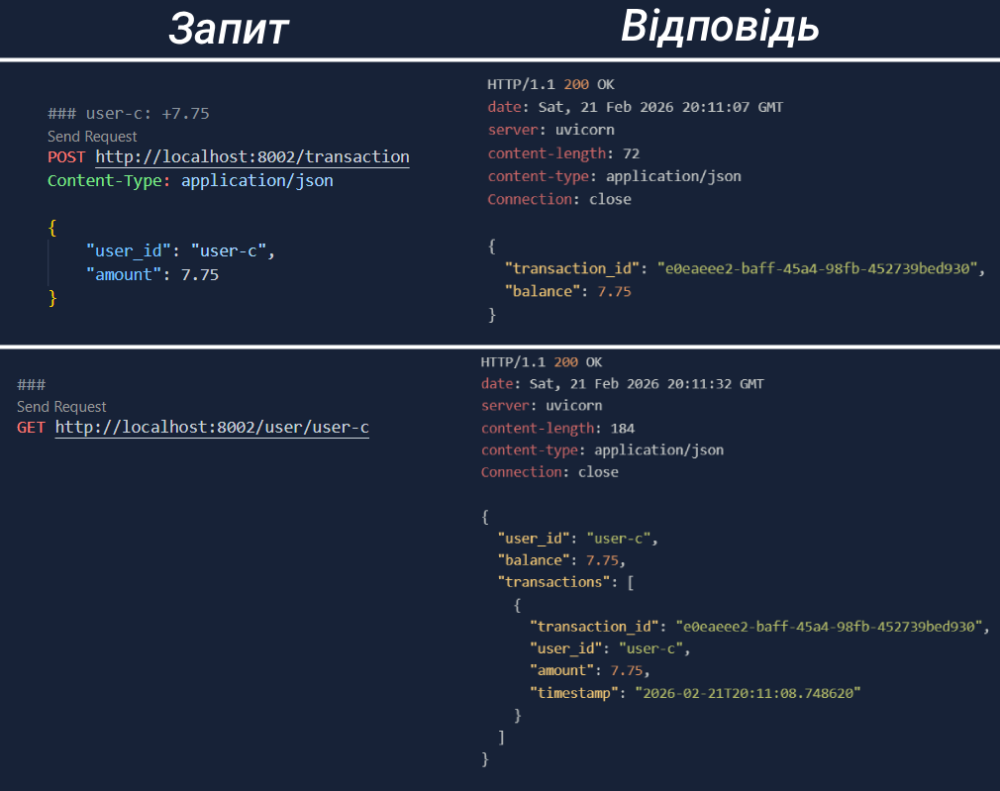
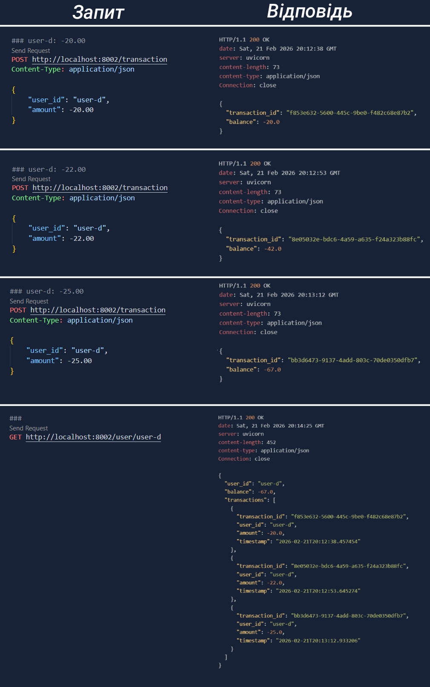
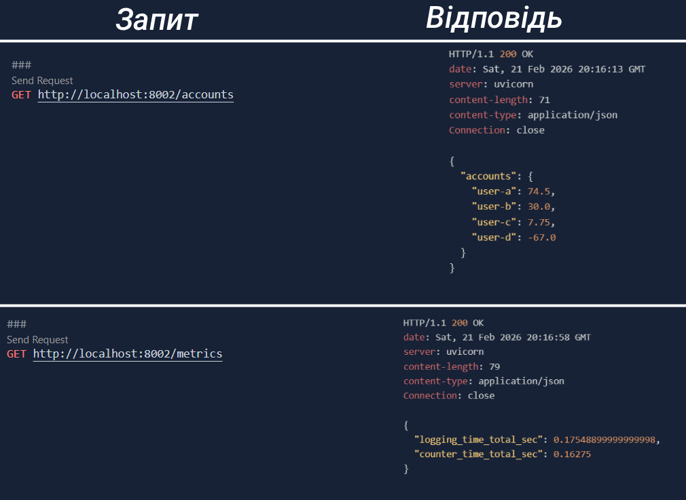
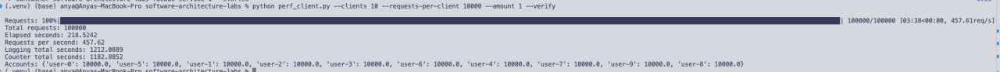
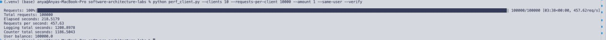

# HW 1

У рамках цієї лабораторної роботи було імплементовано застосунок, що має `POST` та `GET` запити. 

На наступних діаграмах можна побачити те, які сервіси є, та вони між собою взаємодіять:

>   
> HTTP `POST` request flow  


> 
> HTTP `GET` request flow

## Демонстрація роботи мікросервісів
Робота мікросервісів була протестована за допомогою реквестів, що можна знайти у [`test.http`](./test.http).  

Було створено 4 юзери, і для кожного з них було проведено від 1 до 4 транзакцій:  
> 
>  Транзакції для користувача а  


> 
> Транзакції для користувача b  


> 
> Транзакції для користувача c  


> 
> Транзакції для користувача d 

Можна побачити, що баланси й справді збільшуються/зменшуються.  

Також, для повного sanity check, слід подивитися на `GET /accounts`, та `GET /metrics`  

> 
> результати для `GET /accounts`, та `GET /metrics`  

Як можна побачити, усе і справді збігається, що говорить про те, що (ймовірно) все реалізовано добре!  

Також, при виконанні запитів, виводиться інформація у CLI. Дивіться [логи](./assets/logs.txt) *(переніс туда, аби не засоряти readme)*
## Продуктивність системи  
Важливо перевірити продуктивність системи. Для цього було створено скрипт [`perf_client.py`](./perf_client.py).  

> [!IMPORTANT]
> Оскільки мій лептоп не має дуже потужного процесора, я попросив [колегу](https://www.github.com/annastasyshyn) з MacBook Pro M1 проранити тести.  

Було розглягуто 2 сценарії:  

* *"10 клієнтів одночасно роблять по 10К однакових транзакцій по додаванню 1 на свій рахунок. У результаті кінцеве значення балансу на 10-и рахунках має бути по 10К."*  
`python perf_client.py --clients 10 --requests-per-client 10000 --amount 1 --verify`  
Було отримано наступні результати:

```Total requests: 100000
Elapsed seconds: 218.5242
Requests per second: 457.62
Logging total seconds: 1212.0889
Counter total seconds: 1182.8852
Accounts: {'user-0': 10000.0, 'user-5': 10000.0, 'user-1': 10000.0, 'user-2': 10000.0, 'user-3': 10000.0, 'user-6': 10000.0, 'user-4': 10000.0, 'user-7': 10000.0, 'user-9': 10000.0, 'user-8': 10000.0}
```   


* *"10 клієнтів одночасно роблять по 10К однакових транзакцій по додаванню 1 на один і той самий рахунок. У результаті кінцеве значення балансу на одному рахунках має бути 100К."*  
`python perf_client.py --clients 10 --requests-per-client 10000 --amount 1 --same-user --verify`  
Було отримано наступні результати:  
  
```Total requests: 100000
Elapsed seconds: 218.5179
Requests per second: 457.63
Logging total seconds: 1208.8978
Counter total seconds: 1186.5043
User balance: 100000.0
```


## Аналіз результатів продуктивності

Обидва сценарії пройшли успішно:
- У сценарії 1, усі 10 рахунків мають правильний баланс 10К
- У сценарії 2, спільний рахунок має 100К

Система правильно обробляє конкурентні запити без втрати даних. => no data races!


Дані з попереднього підпункту можна формалізувати у табличку:

| Метрика | Сценарій 1 | Сценарій 2 |
|---------|------------|------------|
| Всього запитів | 100,000 | 100,000 |
| Загальний час (с) | 218.52 | 218.52 |
| **RPS** | **457.62** | **457.63** |

Можна побачити, що продуктивність практично ідентична (~458 req/s) незалежно від розподілу навантаження по рахунках.

На основі отриманих логів було розраховано середній час, який витрачає кожен мікросервіс на обробку одного запиту:

* Logging service: ~12.1 мс
* Counter service: ~11.8 мс 
* Загальний overhead на backend: ~23.9 мс

Коефіцієнт паралелізації складає приблизно 11, що вказує на ефективну роботу 10 асинхронних клієнтів. Основна затримка зумовлена послідовними HTTP-викликами від Facade до внутрішніх сервісів.
  

Підбивши це все, можна зробити наступні висновки:
* Наш застосунок добре паралелізується, відносно добре підтримує середню кількість одночасних користувачів, та може підтримувати до 450 запитів у секунду
* Результати ідентичні між різними сценаріями, що каже про стабільність
* Відсутні race conditions  

Проте, є певні проблеми з мережевими викликами (практично весь час запиту витрачається на HTTP до logging/counter).  

Можливим покращенням було би імплементація асинхронного логування, групувати транзакції у batches, та використання gRPC замість HTTP.
