# Homework 5

Ця реалізація переводить систему на Kubernetes і прибирає статичні IP/порти між мікросервісами.


## Installation

Підняти minicube:

```bash
minikube start --cpus=4 --memory=7638 --driver=docker
minikube status
kubectl cluster-info
```  

Білд докер імеджів:
```bash
docker build -t software-architecture-labs/facade-service:lab5 -f app/facade.Dockerfile app
docker build -t software-architecture-labs/logging-service:lab5 -f app/logging.Dockerfile app
docker build -t software-architecture-labs/counter-service:lab5 -f app/counter.Dockerfile app
```

Завантаження їх у Minikube:
```bash
minikube image load software-architecture-labs/facade-service:lab5
minikube image load software-architecture-labs/counter-service:lab5
minikube image load software-architecture-labs/logging-service:lab5
```


```bash

kubectl apply -k k8s

kubectl get ns

kubectl -n micro-lab5 get all
```


```bash
kubectl -n micro-lab5 get pods -w

kubectl -n micro-lab5 describe pod <pod-name>
kubectl -n micro-lab5 logs <pod-name>
```

Коли всі pods будуть Ready, можна йти далі.


```bash
kubectl -n micro-lab5 port-forward svc/facade-service 8002:8002
```

## Testing

### Basic HTTP
Перевіримо базові HTTP запити. 

Слід подивитися, чи сервіс взагалі працює:  
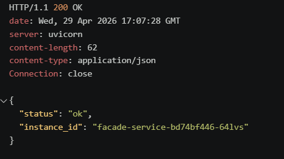


Подивимося, чи діскаверяться відповідні сервіси:  
  

Тепер можна відправити кілька повідомлень:  

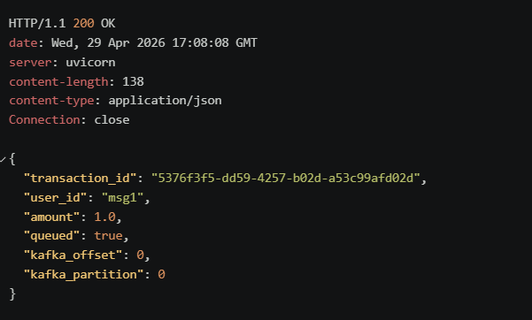  

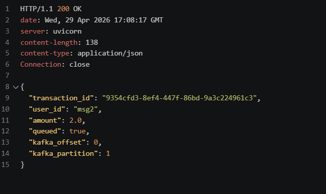  

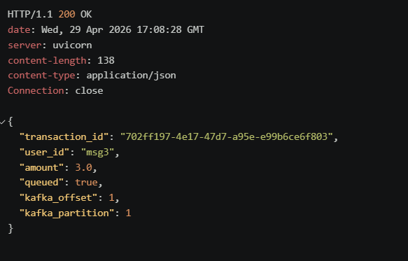  

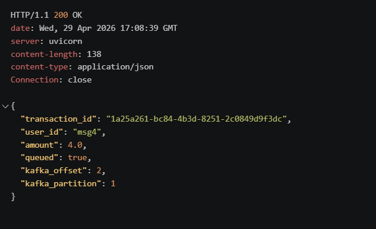 

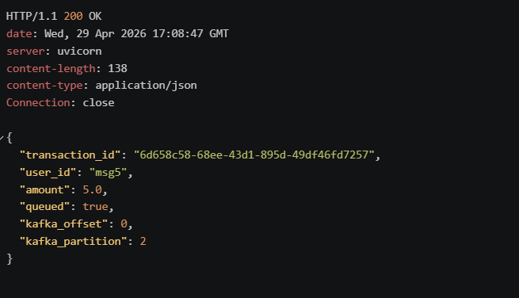  


Переглянемо баланс першого юзера:  

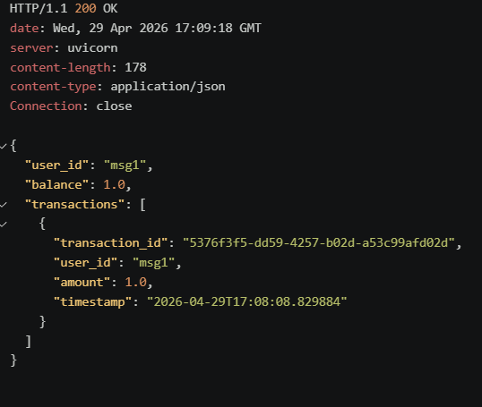  

Можемо переглянути баланси: 

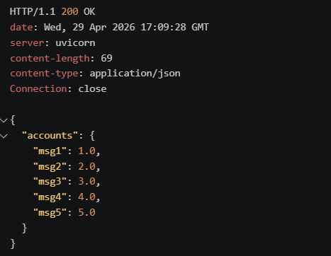  

Та часові метрики:  

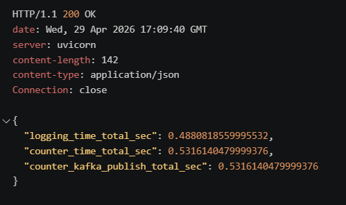

Логи які були записані під час виконання запитів можна знайти у папці [`./service_logs`](service_logs)

### Failover 
  
Я розглянув 3 сценарії, де відключив кожен з сервісів. Для цього я імплементував скрипт, який надсилає реквести з певним інтервалом. Я відкрив 4 термінали (перший - порт форвард, другий pods, третій скрипт, четвертий вбивство сервісів.)  

Скрін pods перед початком роботи: 

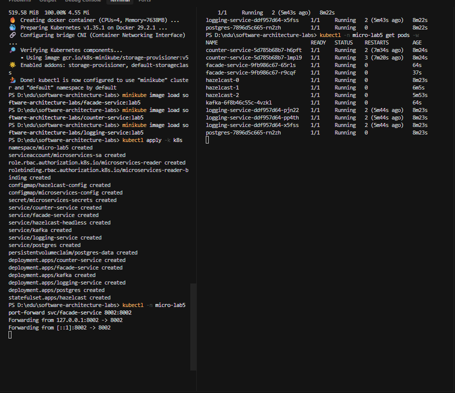  

Тест відключення logging:  
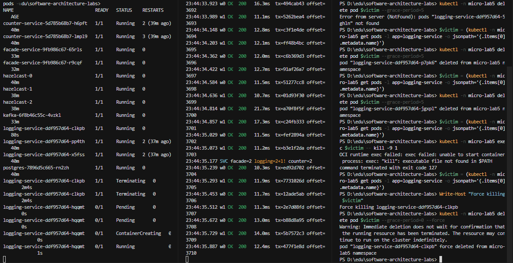 

На скріншоті можна побачити, що заучено лише два logging (пише, 2 + 1). Через деякий час сервіс встає і знову працюють всі 3 інстанси:  
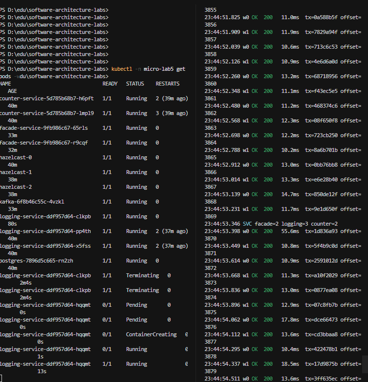  


Тест відключення counter:  

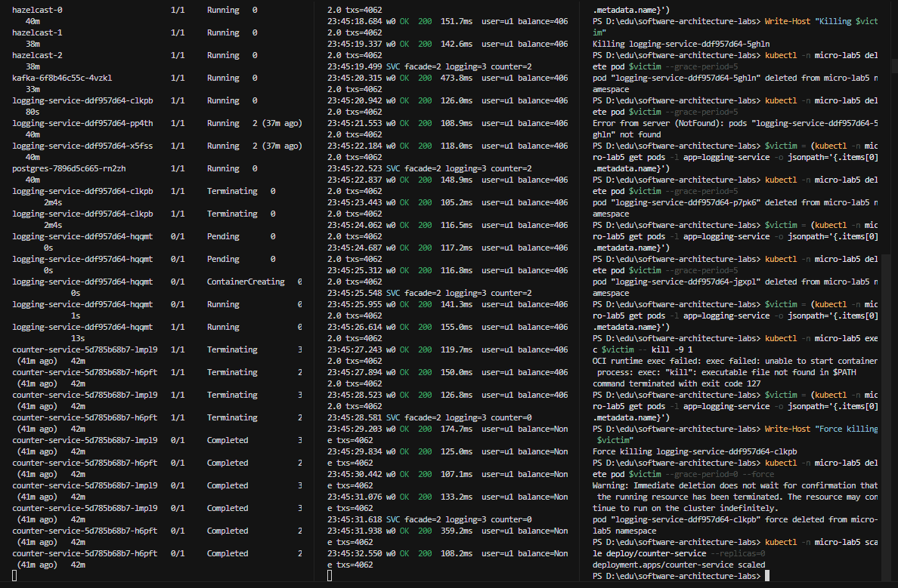  

Аналогічно , можна побачити, що 1 counter впав.  

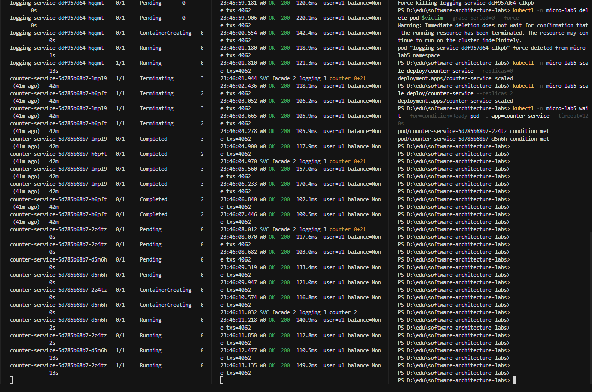  

І як він підіймається, застоунок без проблем продовжує роботу.  

Тест відключення facade:  

Якщо вимкнути facade, то все падає. У тому числі , port forward вікно крашиться і отримує помилку:  
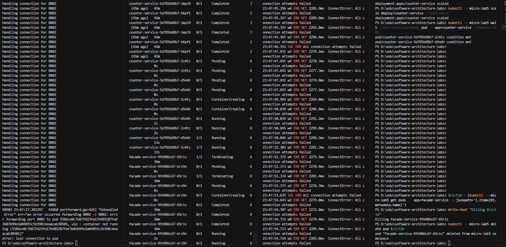
### Performance 

Я використав скрипт з попередніх ДЗ і отримав наступні результати:    

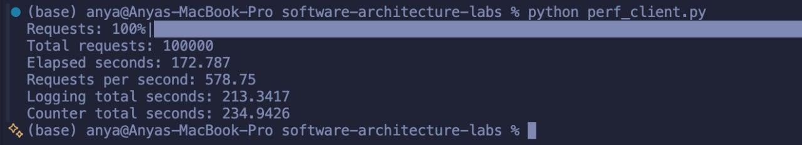  

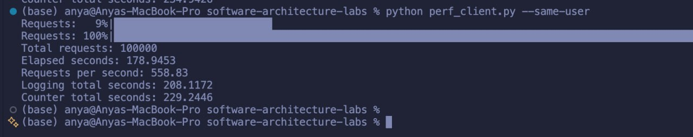
Можемо порівняти результати з іншими ДЗ:  

| Test scenarios | Task 1 (in-mem) | Task 3 (DB) | Task 5 (final) |
| :--- | :--- | :--- | :--- |
| **10 accounts** | **Total time:** 218.52<br><br>**logging-service contribution:** 50.61%<br><br>**counter-service contribution:** 49.39% | **Total time:** 173.67<br><br>**logging-service contribution:** 30.76%<br><br>**counter-service contribution:** 69.24% | **Total time:** 172.79<br><br>**logging-service contribution:** 47.59%<br><br>**counter-service contribution:** 52.41% |
| **1 account** | **Total time:** 218.52<br><br>**logging-service contribution:** 50.47%<br><br>**counter-service contribution:** 49.53% | **Total time:** 159.95<br><br>**logging-service contribution:** 30.11%<br><br>**counter-service contribution:** 69.89% | **Total time:** 178.95<br><br>**logging-service contribution:** 47.58%<br><br>**counter-service contribution:** 52.42% |  

Можна побаячити, що варіант з останньої ДЗ можна назвати найоптимальнішим, оскільки ми рівномірно розподіляємо всю роботу, маємо надійність з Kubernetes, та маємо кращий час через те, що є кілька сервісів.  